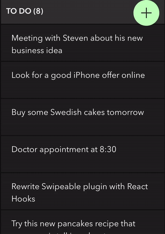

<div align="center">
<h1>FlowTask</h1>
<p>
  <strong>Simple yet interactive task board for your mobile browser.</strong> Written in <strong>React</strong> with <a target="_blank" href="https://github.com/facebook/create-react-app">create-react-app</a>.
</p>

[](https://circleci.com/gh/moubi/flow-task) [](https://lgtm.com/projects/g/moubi/flow-task/context:javascript) [](LICENSE)

  
  <p>
    <a target="_blank" href="https://flowtask.webup.org/demo">We have live demo too!</a>
  </p>
</div>

## Getting started
Go to your project folder and
```
git clone git@github.com:moubi/flow-task.git
cd flow-task/
yarn
yarn start
```

That's it. Navigating to http://localhost:3002 will bring the board with some example data from the localStorage.

### Prior installation
The project is built with node version **10.15.1**. This is set in the `.nvmrc` file. You may need to additionally install it on your development machine. With `nvm`:
```
nvm install 10.15.1
nvm use
```

## Backend integration
`master` branch represents pure frontend app that uses _**localStorage database**_ for columns and tasks data. This is set in `src/lib/Api.js`. There are also two backend integrations for deployment on php and node enabled hostings.

 - Php ([feature/php-backend](https://github.com/moubi/flow-task/tree/feature/php-server) branch)
 - Node ([feature/node-backend](https://github.com/moubi/flow-task/tree/feature/node-server) branch)

Check corresponding READMEs for more info.

## Tests
Trigger the test suite by

```
yarn test
```

Tests cover all the components, reducers and actions. Each test (`*.test.js`) is placed next to its target file.

## Deployment
To build a `create-react-app` project run:

```
yarn build
```

All the production files are then stored in the `build/` folder.

[Node](https://github.com/moubi/flow-task/tree/feature/node-server) and [php](https://github.com/moubi/flow-task/tree/feature/php-server) backends have their own build process.

## Support
Though, it implements several interesting ideas and UI effects, the board was initially intended to serve personal goals and developed for _**latest iOS Safari**_.

## Contributing (aka roadmap)
 - Android support - there shouldn't be much missing
 - DB implementation (perhaps MongoDB?)
 - Keep it simple, quick, but interactive (challenge: having usable, but not sassy UI)
 - Avoid being Trello, Jira or Asana board alternative

Good starting point is the [repo's project](https://github.com/moubi/flow-task/projects/1).
Open an issue if you need (there is no strict rule or a template) or email me directly. Your contribution is 100% welcome.

## Authors
[Miroslav Nikolov](https://webup.org)

## License
[MIT](LICENSE)

## Acknowledgments
* [swipeable-react](https://github.com/moubi/swipeable-react) - catching swipe interactions
* [react-beautiful-dnd](https://github.com/atlassian/react-beautiful-dnd) - great drag and drop module for React
* [unexpected-dom](https://github.com/unexpectedjs/unexpected-dom) - easily test React components and events
